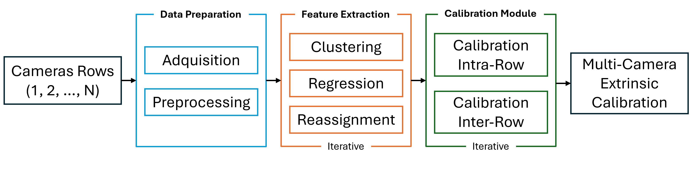

# Marker-Based Extrinsic Calibration Method for Accurate Multi-Camera 3D Reconstruction

Project Page: [Tech4Diet](https://tech4d.ua.es/) \
Full Paper: [Link](https://arxiv.org/abs/2505.02539)

## License 

Software Copyright License for non-commercial scientific research purposes.

## 🎯 Abstract

Accurate 3D reconstruction using multi-camera RGB-D systems critically depends on precise extrinsic calibration to achieve proper alignment between captured views. In this paper, we introduce an iterative extrinsic calibration method that leverages the geometric constraints provided by a three-dimensional marker to significantly improve calibration accuracy. Our proposed approach systematically segments and refines marker planes through clustering, regression analysis, and iterative reassignment techniques, ensuring robust geometric correspondence across camera views. We validate our method comprehensively in both controlled environments and practical real-world settings within the Tech4Diet project, aimed at modeling the physical progression of patients undergoing nutritional treatments. Experimental results demonstrate substantial reductions in alignment errors, facilitating accurate and reliable 3D reconstructions.

<p align="center">
  
</p>

## Content
The provided code has been tested with Matlab R2018b on Ubuntu 20.04.6.

Dataset Sample: [Tech4Diet Cubes Dataset](https://1024terabox.com/s/181hQTt6sw1xjKRGTbi3uMQ)

### Usage

Place the download dataset in the root folder
```bash
    $PATH_TO_REPO/
    ├── Code
    ├── Dataset
    │   ├── R1H2
    │   ├── R3H2
    │   ├── R4H2
    │   ├── R34
```
Then, follow these steps:

1. Execute FeatureExtraction.m to identify and extract markers from the captured data.
2. Execute Calibration.m to perform calibration and generate the calibration matrix.

## 🤝 Aknoledgments

This work has been funded by the Spanish State Research Agency (AEI) through the grant PID2023-149562OB-I00, awarded by the MCIN/AEI/10.13039/501100011033, as well as by the consolidated group project CIAICO/2022/132 "AI4Health", financed by the Government of the Valencian Community.

## 🔗 CItation

--

## Contact

For questions or commercial licensing (and all related questions for business applications), please contact:
- [nahuel.garcia@ua.es](mailto:nahuel.garcia@ua.es)
- [fuster@ua.es](mailto:fuster@ua.es)
- [jazorin@ua.es](mailto:jazorin@ua.es)

